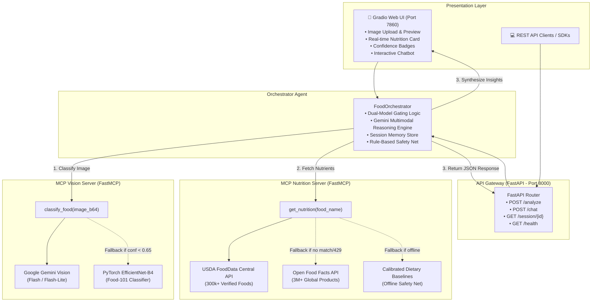

# 🥑 Multimodal Food Agent

[](https://www.python.org/downloads/)
[](https://fastapi.tiangolo.com)
[](https://gradio.app)
[](https://modelcontextprotocol.io/)
[](https://pytorch.org/)

> An end-to-end, production-grade AI system that identifies food dishes from photographs, queries verified nutritional databases via the **Model Context Protocol (MCP)**, and provides calibrated, context-aware dietary guidance through multimodal LLM reasoning.

---

## 🌟 Key Features

| Feature | Description |
|---|---|
| **Multimodal Vision Pipeline** | Primary classification via **Google Gemini Multimodal Vision (Flash / Flash-Lite)**, backed by an on-device **PyTorch EfficientNet-B4** Food-101 classifier. |
| **Calibrated Confidence Gating** | Automated confidence scoring with honest uncertainty flags (`🟢 High`, `🟡 Moderate`, `🔴 Low`). Alerts users when visual ambiguity occurs. |
| **Dual-Tier Nutrition Retrieval** | Cascading knowledge retrieval querying **USDA FoodData Central** (primary) and **Open Food Facts** (fallback for international foods), backed by calibrated nutritional reference baselines. |
| **Model Context Protocol (MCP)** | Decoupled architecture using **FastMCP** tool servers (`vision-server` & `nutrition-server`) enabling interoperability across LLMs and agents. |
| **Contextual Dialogue Memory** | State-managed multi-turn conversation memory tracking uploaded dishes and nutritional metrics for nuanced dietary follow-ups. |
| **Modern Dual-Interface Access** | Interactive **Gradio Blocks UI** for end-users + high-performance **FastAPI REST gateway** (`/analyze`, `/chat`, `/health`, `/session`) for programmatic integration. |
| **Production-Ready & Tested** | Comprehensive `pytest` test harness with mock/live verification across vision, nutrition, orchestrator, and API endpoints. Docker & Docker Compose deployment ready. |

---

## 🏗️ System Architecture

The following diagram illustrates the flow of information across the user interfaces, API gateway, orchestrator agent, and MCP tool servers:



---

## 🧰 Technology Stack

- **Large Language Models**: Google Gemini (`gemini-flash-lite`, `gemini-3.6-flash`, `gemini-3.5-flash`) via `google-generativeai`
- **Computer Vision**: PyTorch, TorchVision (EfficientNet-B4), Pillow (PIL)
- **Tool Protocol**: Model Context Protocol (MCP) via `mcp.server.mcpserver` / FastMCP
- **API Gateway**: FastAPI, Pydantic v2, Uvicorn, Starlette
- **User Interface**: Gradio 6.0 (`gr.Blocks`, `gr.Chatbot`, `gr.Examples`)
- **Data Providers**: USDA FoodData Central REST API, Open Food Facts JSON API
- **Testing & Quality**: pytest, pytest-asyncio, HTTPX / TestClient
- **Containerization**: Docker, Docker Compose

---

## ⚙️ Installation & Setup

### 1. Prerequisites
- Python 3.10 or 3.11 installed.
- (Optional) Git and Docker.

### 2. Clone and Setup Virtual Environment
```bash
# Clone the repository
git clone https://github.com/yourusername/multimodal-food-agent.git
cd multimodal-food-agent

# Create and activate virtual environment
python -m venv .venv

# On Windows (PowerShell):
.\.venv\Scripts\Activate.ps1
# On Linux / macOS:
source .venv/bin/activate

# Install dependencies
pip install --upgrade pip
pip install -r requirements.txt
```

### 3. Configure API Keys (`.env`)
Copy the example environment file:
```bash
cp .env.example .env
```
Open `.env` and configure your keys:
```ini
# Google Gemini API Key (Get at https://aistudio.google.com/)
GEMINI_API_KEY=your_gemini_api_key_here

# USDA FoodData Central API Key (Get at https://fdc.nal.usda.gov/api-key-signup.html)
# Optional: Defaults to DEMO_KEY if not specified
USDA_API_KEY=DEMO_KEY

# Server Configuration
HOST=0.0.0.0
PORT=7860
FASTAPI_PORT=8000
```

> [!NOTE]
> The system includes intelligent rule-based fallbacks. If no Gemini API key is provided, the agent automatically falls back to on-device PyTorch classification and deterministic nutritional heuristics without crashing.

---

## 🚀 Usage Guide

### Option 1: Running the Gradio Web UI
Launch the interactive web interface on `http://localhost:7860`:
```bash
python ui/app.py
```
- **Image Upload**: Drag-and-drop any food image or click on the built-in quick test samples.
- **Nutritional Card**: View real-time calories, protein, carbohydrates, fats, fiber, and sodium.
- **Confidence Badges**: Inspect whether the vision model identified the food with High, Moderate, or Low confidence.
- **Interactive Chat**: Ask follow-up dietary questions (e.g. *"How can I modify this dish for a ketogenic diet?"* or *"What is the fiber content?"*).

### Option 2: Running the FastAPI Gateway
Launch the REST API server on `http://localhost:8000`:
```bash
uvicorn api.main:app --host 0.0.0.0 --port 8000 --reload
```
Interactive Swagger API documentation is available at:
- Swagger UI: `http://localhost:8000/docs`
- Redoc: `http://localhost:8000/redoc`

#### Example REST API Calls:
**Health Check:**
```bash
curl -X GET http://localhost:8000/health
```

**Analyze Food (JSON):**
```bash
curl -X POST http://localhost:8000/analyze \
  -H "Content-Type: application/json" \
  -d '{
    "image_b64": "<base64_encoded_jpeg_string>",
    "question": "Is this meal suitable for a low-carb diet?"
  }'
```

**Follow-up Chat Inquiry:**
```bash
curl -X POST http://localhost:8000/chat \
  -H "Content-Type: application/json" \
  -d '{
    "session_id": "<session_id_from_analyze>",
    "question": "What are the macro ratios for this dish?"
  }'
```

---

## 🧪 Evaluation Harness & Tests

The project includes a structured evaluation harness with a 20-food benchmark dataset (`eval/expected_labels.csv`) and a 7-part comprehensive pytest suite.

### Generate Evaluation Placeholder Images
To generate 20 sample test images without downloading large external binary files:
```bash
python eval/food_samples/generate_samples.py
```

### Run the PyTest Suite
Execute the full test suite covering vision gating, USDA lookups, Open Food Facts fallback, orchestrator sessions, and FastAPI endpoints:
```bash
pytest eval/test_pipeline.py -v
```

#### Test Suite Breakdown:
1. `test_1_vision_classification_and_fallback`: Validates vision server schema, confidence bounding, and corrupt input handling.
2. `test_2_nutrition_usda_lookup`: Validates USDA lookup for apple pie and macro parsing.
3. `test_3_nutrition_openfoodfacts_fallback`: Validates international Open Food Facts parsing and cascaded lookup for baguette.
4. `test_4_confidence_gating_logic`: Validates badge derivation (`🟢 High`, `🟡 Moderate`, `🔴 Low`) and uncertainty threshold gating (< 0.65).
5. `test_5_orchestrator_analyze_workflow`: Validates full end-to-end flow from image to dietary recommendation.
6. `test_6_orchestrator_chat_session_memory`: Validates multi-turn context retention across follow-up queries.
7. `test_7_fastapi_endpoints`: Validates REST endpoints (`/health`, `/analyze`, `/chat`, `/session/{id}`).

---

## 🐳 Docker Deployment

The application includes multi-stage container definitions optimized for container environments and HuggingFace Spaces.

### Deploy with Docker Compose
```bash
docker-compose up --build
```
This launches:
- **Gradio Web Interface**: `http://localhost:7860`
- **FastAPI Gateway**: `http://localhost:8000`

### Deploy with Docker CLI
```bash
docker build -t multimodal-food-agent .
docker run -p 7860:7860 -e GEMINI_API_KEY="your_api_key" multimodal-food-agent
```

---

## 🔌 Model Context Protocol (MCP) Architecture

This system leverages the **Model Context Protocol (MCP)** to separate capabilities into modular micro-servers:

### 1. Vision MCP Server (`mcp_servers/vision_server/`)
- **Tool**: `classify_food(image_b64: str) -> dict`
- **Gating Logic**:
  - `Gemini Vision Confidence >= 0.65` ➔ Return Gemini prediction.
  - `EfficientNet-B4 Confidence >= 0.65` ➔ Return PyTorch prediction.
  - `Both < 0.65` ➔ Return top candidate with `uncertain: True` flag.

### 2. Nutrition MCP Server (`mcp_servers/nutrition_server/`)
- **Tool**: `get_nutrition(food_name: str, serving_size_g: int = 100) -> dict`
- **Cascading Resolution**:
  - `Tier 1`: USDA FoodData Central search.
  - `Tier 2`: Open Food Facts search for international foods or fallback.
  - `Tier 3`: Standard reference estimates baseline for zero-downtime offline reliability.

---

## ⚖️ Medical Disclaimer

> [!WARNING]
> **Important Medical & Educational Disclaimer**  
> The nutritional estimations and dietary feedback provided by this system are intended strictly for educational and informational purposes. They do not constitute certified medical diagnosis, nutritional prescriptions, or individualized healthcare advice. Always consult a registered dietitian, physician, or certified health professional before making significant changes to your diet or if managing chronic health conditions (such as diabetes, hypertension, or food allergies).
